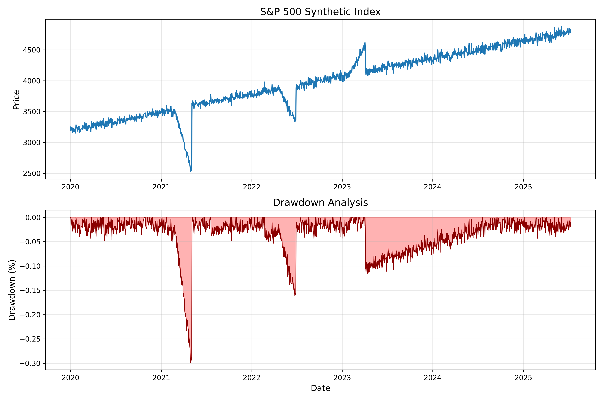

# S&P 500 ETF Risk Analysis
**S&P Global Pain Point Solved**: Automated ETF risk reporting with market event simulation

## Project Overview
- Calculates volatility and max drawdown
- Simulates market events (COVID crash, inflation surge)
- Generates professional research report
- Institutional-quality visualization

## Key Metrics


## How to Run
```bash
pip install pandas numpy matplotlib
jupyter notebook sp500_analysis.ipynb